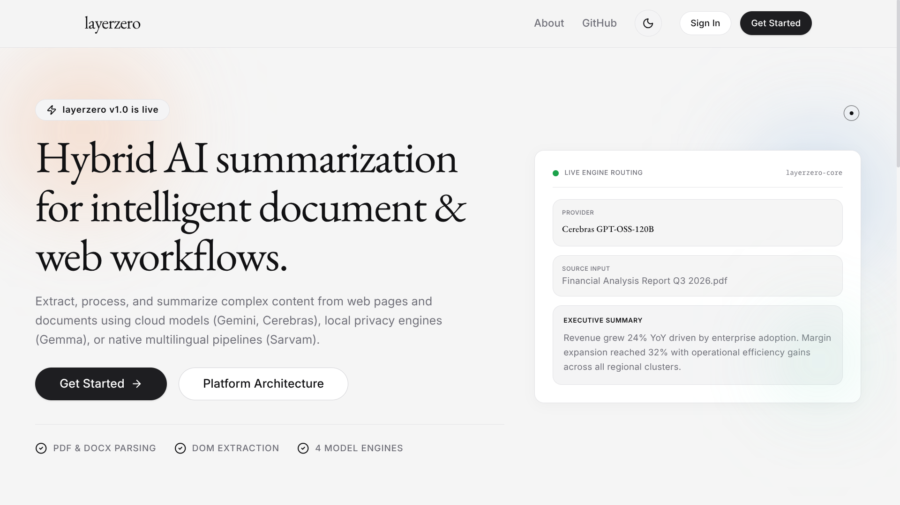
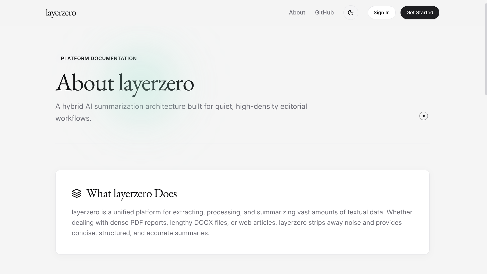
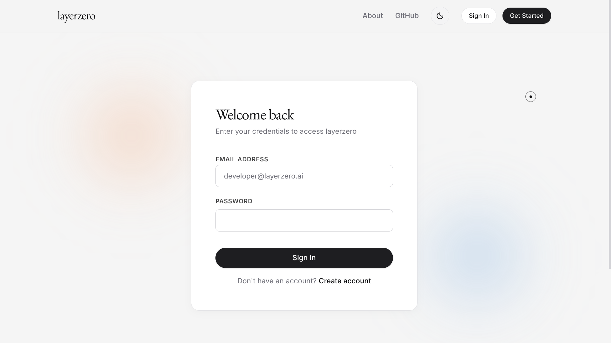
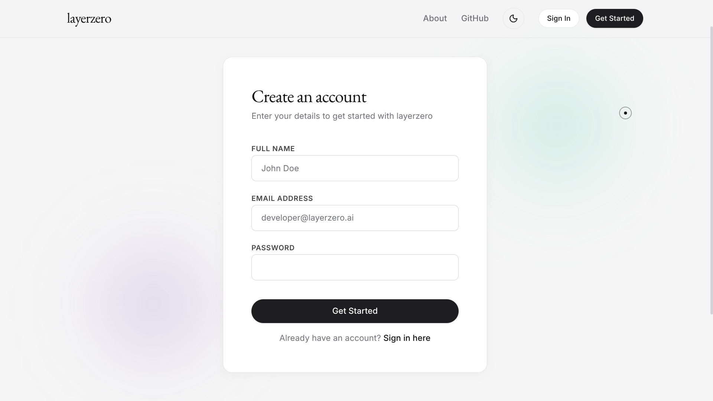
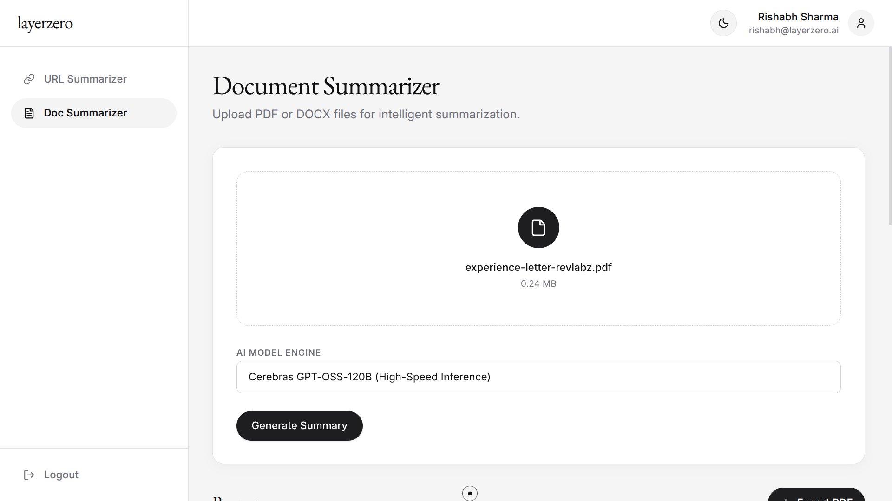

# Layerzero

AI-powered content summarization platform built with React, Express.js, MongoDB, and a hybrid LLM architecture.

Layerzero allows users to summarize PDFs, DOCX files, and web content using cloud-based or locally hosted language models. The platform focuses on simplicity, speed, and flexibility while providing a secure authentication layer and a clean content-processing pipeline.

---

## Overview

Most content summarization tools force users into a single AI provider.

Layerzero takes a different approach.

Users can choose between:

* **Gemini 2.5 Flash** for powerful cloud-based inference
* **GPT OSS 120B via Cerebras** for fast, open-source cloud inference
* **Gemma 4 via Ollama** for local inference and privacy-focused workflows* 
* **Sarvam 30B** for Hinglish and multilingual conversational workflows*

Whether you're summarizing a research paper, technical documentation, blog post, or an article you definitely intended to read later, Layerzero extracts the content and generates concise summaries within seconds.

---

## Screenshots

<table>
  <tr>
    <td align="center">
      <strong>Homepage</strong><br>
      
    </td>
    <td align="center">
      <strong>About</strong><br>
      
    </td>
  </tr>
  <tr>
    <td align="center">
      <strong>Login</strong><br>
      
    </td>
    <td align="center">
      <strong>Register</strong><br>
      
    </td>
  </tr>
  <tr>
    <td align="center">
      <strong>Doc Summarizer</strong><br>
      
    </td>
    <td align="center">
      <strong>Response</strong><br>
      
    </td>
  </tr>
</table>

---

## Features

### Content Ingestion

* PDF document uploads (parsed via `pdfjs-dist`)
* DOCX document uploads
* Website URL summarization
* Automatic text extraction
* Article content parsing using Mozilla Readability
* Unified document processing pipeline with mimetype-based routing

### Intelligent Caching

* Upstash Redis-powered caching layer
* SHA-256 content fingerprinting for document and URL deduplication
* Cache-first retrieval for previously processed content
* Automatic 1-day cache expiration via Redis TTLs
* Eliminates redundant LLM inference for identical requests
* Reduced repeated summary latency from ~8.5s to ~150ms (~98% improvement)

### AI-Powered Summarization & Streaming

* Real-Time Token Streaming (Server-Sent Events / SSE)
* Gemini 2.5 Flash integration
* GPT OSS 120B integration via Cerebras
* Gemma 4 integration via Ollama
* Sarvam 30B integration
* Four user-selectable AI models
* Hybrid cloud/local architecture
* Flexible inference workflows
* Hinglish-friendly and multilingual support via Sarvam

### Authentication & Security

* JWT Authentication via httpOnly cookies
* Protected API routes
* Strict payload validation using Zod schemas
* Secure password hashing with bcrypt
* Middleware-based authorization
* Custom Upstash Redis sliding window rate limiting (`@upstash/ratelimit`) on auth and LLM routes

### Testing & Reliability

* Automated unit and integration testing suite via Jest & Supertest
* In-memory MongoDB (`mongodb-memory-server`) for fast, isolated test runs
* Automated test coverage for authentication flows and health checks

### Infrastructure

* One-command startup script (`start.sh`) for Docker Compose
* Docker Compose setup for client, server, and Redis
* AWS EC2 deployment for backend services (HTTP / HTTPS with SSL support)
* Automated CI/CD pipeline via GitHub Actions
* Centralized server source directory (`server/src/`) with `app.js` and `server.js` separation
* Upstash Redis integration for intelligent summary caching and rate limiting
* SHA-256 content hashing for cache deduplication
* Cache-first retrieval strategy with automatic TTL expiration
* Local Ollama support via `host.docker.internal`

### Export

* PDF export of generated summaries via jsPDF
* Markdown-to-plain-text conversion before export for clean output

### Multilingual Support

Layerzero includes Sarvam 30B support for Hinglish and multilingual interactions.

This enables more natural summarization and conversational workflows for users who frequently switch between English and Indian languages, while maintaining the same unified processing pipeline used across all supported models.

---

## Architecture

```text
┌─────────────────┐
│  React Client   │
└────────┬────────┘
         │
         ▼
┌─────────────────┐
│  Express Server │
└────────┬────────┘
         │
         ▼
┌─────────────────┐
│ Content Parsing │
└────────┬────────┘
         │
         ▼
┌─────────────────┐
│ SHA-256 Hashing │
└────────┬────────┘
         │
         ▼
┌─────────────────┐
│   Redis Cache   │
└────┬─────────┬──┘
     │Hit      │Miss
     ▼         ▼
   Summary   Model Selection
                   │
           ┌───────┼───────┬───────┐
           ▼       ▼       ▼       ▼
        Gemini   GPT OSS  Gemma  Sarvam
                   │
                   ▼
                 Summary
                   │
                   ▼
              Store in Redis
```

---

## Website Summarization Flow

```text
URL
 │
 ▼
Axios
 │
 ▼
JSDOM
 │
 ▼
Mozilla Readability
 │
 ▼
Article Extraction
 │
 ▼
Selected Model
 │
 ▼
Summary
```

### Technologies Used

* Axios
* JSDOM
* Mozilla Readability
* Gemini API
* Cerebras API
* Gemma 4

---

## Document Summarization Flow

```text
PDF / DOCX Upload
       │
       ▼
    Multer
       │
       ▼
  extractText()
  (mimetype routing)
       │
   ┌───┴───┐
   ▼       ▼
pdfjs-dist mammoth
   │       │
   └───┬───┘
       ▼
 Text Extraction
       │
       ▼
 Selected Model
       │
       ▼
   Summary
```

### Technologies Used

* Multer
* pdfjs-dist
* mammoth
* Gemini API
* Cerebras API
* Gemma 4
* Sarvam AI

---

## Tech Stack

### Frontend

* React
* TypeScript
* Tailwind CSS
* shadcn/ui
* jsPDF
* remark-gfm & rehype-raw

### Backend

* Node.js
* Express.js v5
* morgan (HTTP Logger)

### Database

* MongoDB via Mongoose

### Caching & Rate Limiting

* Upstash Redis (`@upstash/redis`)
* Upstash Ratelimit (`@upstash/ratelimit`)

### Authentication & Security

* JWT
* bcrypt
* Zod

### Content Processing

* Axios
* JSDOM
* Mozilla Readability (`@mozilla/readability`)
* Multer
* pdfjs-dist
* mammoth

### Testing

* Jest
* Supertest
* mongodb-memory-server

### Infrastructure

* Docker & Docker Compose
* AWS EC2
* GitHub Actions
* Redis

### AI Models

* Gemini 2.5 Flash
* GPT OSS 120B (via Cerebras)
* Gemma 4 (via Ollama)
* Sarvam 30B

---

## API Endpoints

### Authentication

#### Register

```http
POST /api/auth/user/register
```
*Returns `201 Created` with user object and sets `jwt` httpOnly cookie.*

#### Login

```http
POST /api/auth/user/login
```

#### Logout

```http
POST /api/auth/user/logout
```

#### Check Authentication

```http
GET /api/auth/user/check
```

---

### Protected Routes

Authentication required. All endpoints support both standard JSON responses and real-time Server-Sent Events (SSE) streaming.

#### Website Summarization

```http
POST /api/scrape/web
```

Request Body

```json
{
  "url": "https://example.com/article",
  "client": "gemini",
  "stream": true
}
```

`client` accepts:

* `gemini`
* `cerebras`
* `gemma`
* `sarvam`

*Optional*: Send `stream: true` in JSON body or pass `?stream=true` as a query parameter to enable real-time SSE token streaming (`text/event-stream`).

---

#### Document Summarization (PDF / DOCX)

```http
POST /api/scrape/doc
```

Content-Type

```text
multipart/form-data
```

Fields

```text
document: file.pdf or file.docx
client: gemini or cerebras or gemma or sarvam
stream: true (optional)
```

*Optional*: Include `stream: true` to receive a real-time SSE token stream (`text/event-stream`).

---

## Project Structure

```bash
Layerzero/
│
├── docker-compose.yml
├── start.sh
├── README.md
│
├── client/
│   ├── Dockerfile
│   └── src/
│       ├── components/
│       ├── pages/
│       ├── context/
│       ├── layouts/
│       └── lib/
│
└── server/
    ├── Dockerfile
    ├── jest.config.js
    ├── src/
    │   ├── app.js
    │   ├── server.js
    │   ├── config/
    │   ├── controllers/
    │   ├── middlewares/
    │   ├── models/
    │   ├── routes/
    │   ├── services/
    │   ├── utils/
    │   └── validators/
    └── tests/
        ├── setup.js
        ├── auth.test.js
        └── health.test.js
```

## Deployment

The backend server is deployed on an **AWS EC2 instance**, managed through a fully automated CI/CD pipeline using **GitHub Actions**. Every push to the main branch automatically builds and deploys the latest version to the server, ensuring rapid and consistent updates.

---

## Quick Startup (with Docker)

Run the convenient startup script to build and launch all services in detached mode:

```bash
./start.sh
```

Or manually using Docker Compose:

```bash
docker compose up --build -d
```

This starts the client, server, and Redis containers together.

> To use Gemma locally inside Docker, ensure Ollama is running on your host machine and set `OLLAMA_BASE_URL=http://host.docker.internal:11434` in your server `.env`.

---

## Running Backend Tests

Layerzero features an automated testing suite using Jest, Supertest, and an in-memory MongoDB server.

```bash
cd server
npm test
```

---

## Running Locally (without Docker)

### Clone Repository

```bash
git clone https://github.com/render-TheVoid/layerzero.git
cd layerzero
```

### Install Backend Dependencies

```bash
cd server
npm install
```

### Install Frontend Dependencies

```bash
cd client
npm install
```

### Configure Environment Variables

```env
PORT=
MONGODB_URI=
OLLAMA_MODEL=
OLLAMA_BASE_URL=
GEMINI_API_KEY=
CEREBRAS_API_KEY=
SARVAM_API_KEY=
JWT_SECRET=
NODE_ENV=
CLIENT_URL=
UPSTASH_REDIS_REST_URL=
UPSTASH_REDIS_REST_TOKEN=
```

### Run Development Servers

Backend

```bash
npm run dev
```

Frontend

```bash
npm run dev
```

---

## Why Layerzero?

Most summarization platforms rely entirely on cloud-hosted AI.

Layerzero combines cloud and local inference, giving users more control over privacy, performance, and operational costs.

Benefits include:

* Reduced API dependency
* Local AI execution
* Four selectable AI models
* Real-time streaming support
* Improved privacy via local inference
* Hybrid cloud/local architecture

Because sometimes you want the power of a cloud model, and sometimes you want your laptop to suffer instead.

---

## Current Limitations

* No document history
* No persistent summary storage
* Single-document processing

---

## Coming Soon

* Summary history and persistence
* Multi-document summarization
* Background processing for large documents

---

## License

MIT License

---

Built with React, Node (Express), MongoDB, Redis and a stubborn refusal to choose between cloud AI and local AI.