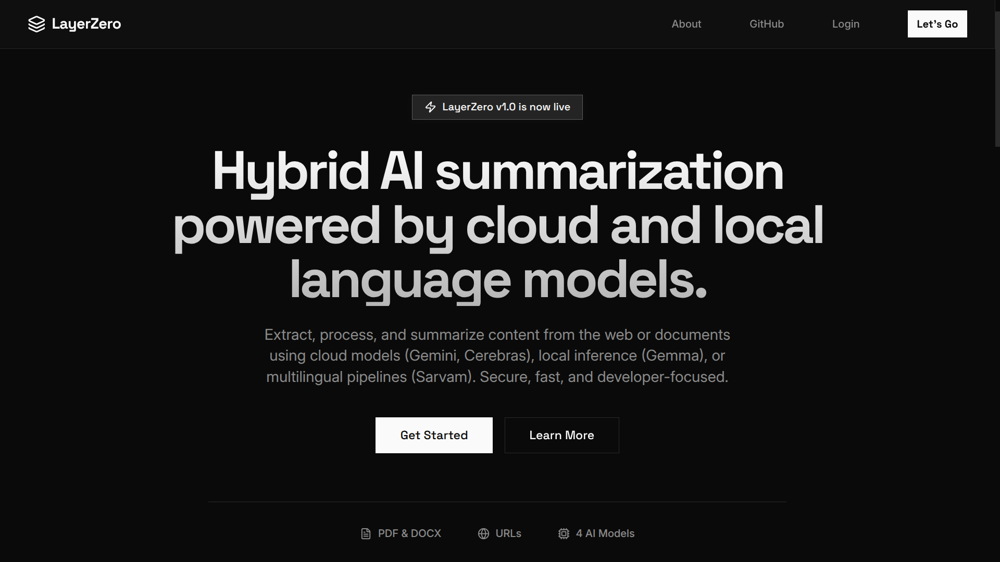
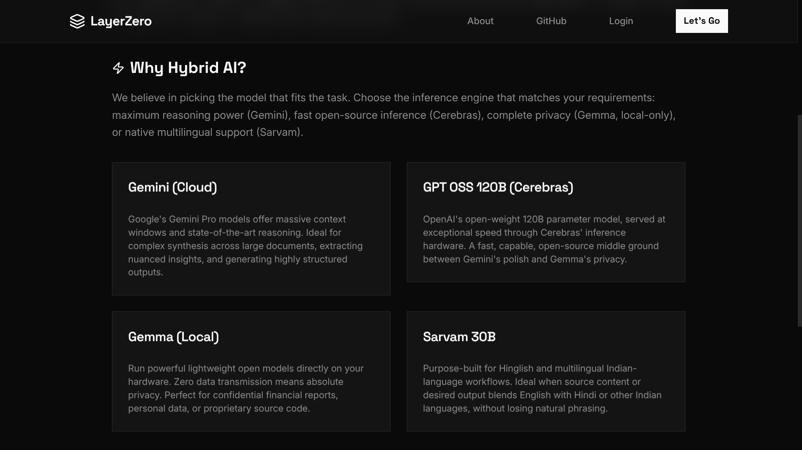
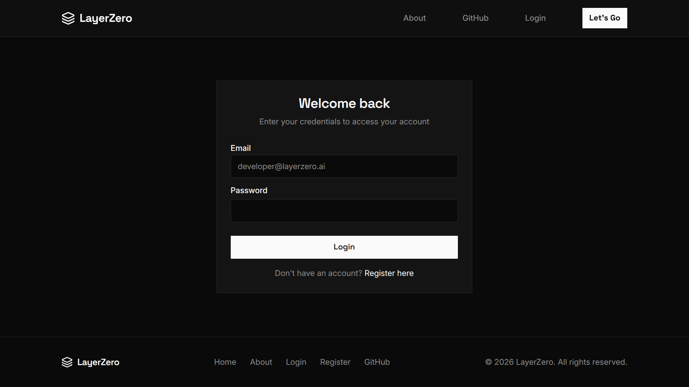
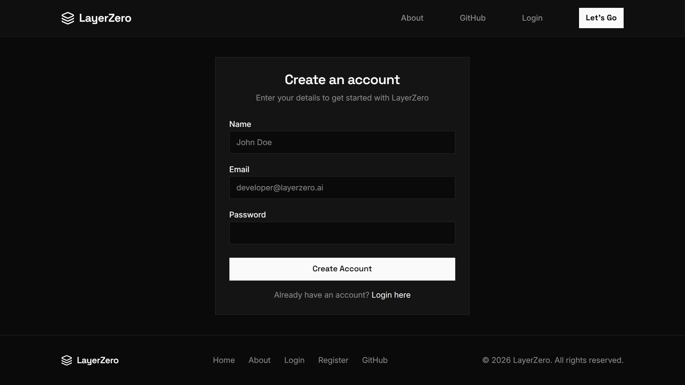
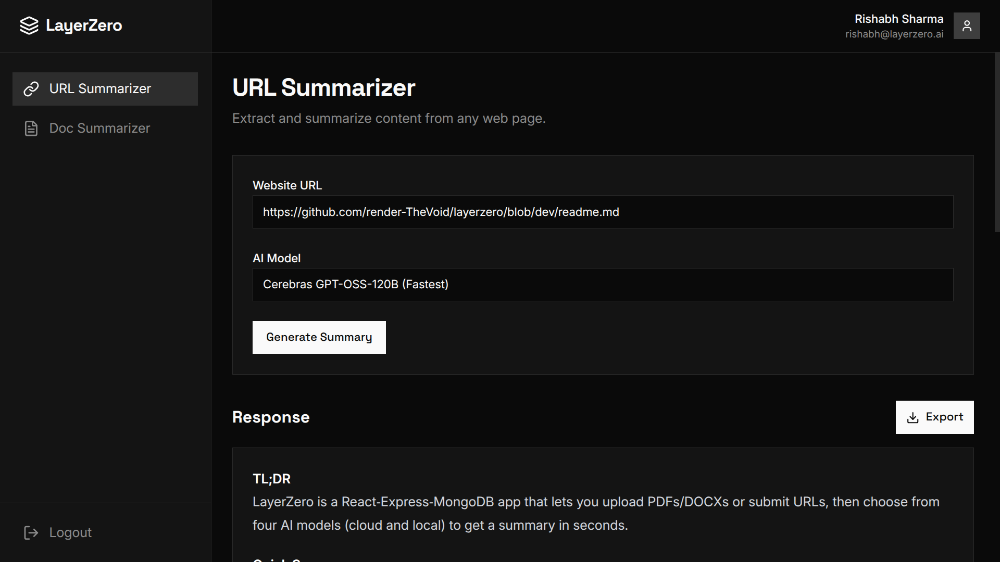
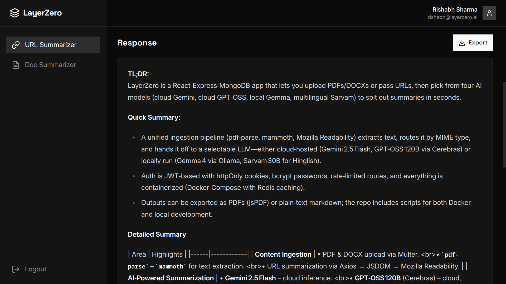

# LayerZero

AI-powered content summarization platform built with React, Express.js, MongoDB, and a hybrid LLM architecture.

LayerZero allows users to summarize PDFs, DOCX files, and web content using cloud-based or locally hosted language models. The platform focuses on simplicity, speed, and flexibility while providing a secure authentication layer and a clean content-processing pipeline.

---

## Overview

Most content summarization tools force users into a single AI provider.

LayerZero takes a different approach.

Users can choose between:

* **Gemini 2.5 Flash** for powerful cloud-based inference
* **GPT OSS 120B via Cerebras** for fast, open-source cloud inference
* **Gemma 4 via Ollama** for local inference and privacy-focused workflows* 
* **Sarvam 30B** for Hinglish and multilingual conversational workflows*

Whether you're summarizing a research paper, technical documentation, blog post, or an article you definitely intended to read later, LayerZero extracts the content and generates concise summaries within seconds.

---

## Screenshots

<table>
  <tr>
    <td align="center">
      <strong>Homepage</strong><br>
      
    </td>
    <td align="center">
      <strong>About</strong><br>
      
    </td>
  </tr>
  <tr>
    <td align="center">
      <strong>Login</strong><br>
      
    </td>
    <td align="center">
      <strong>Register</strong><br>
      
    </td>
  </tr>
  <tr>
    <td align="center">
      <strong>URL Summarizer</strong><br>
      
    </td>
    <td align="center">
      <strong>Response</strong><br>
      
    </td>
  </tr>
</table>

---

## Features

### Content Ingestion

* PDF document uploads
* DOCX document uploads
* Website URL summarization
* Automatic text extraction
* Article content parsing using Mozilla Readability
* Unified document processing pipeline with mimetype-based routing

### Intelligent Caching

* Upstash Redis-powered caching layer
* SHA-256 content fingerprinting for document and URL deduplication
* Cache-first retrieval for previously processed content
* Automatic 7-day cache expiration via Redis TTLs
* Eliminates redundant LLM inference for identical requests
* Reduced repeated summary latency from ~8.5s to ~150ms (~98% improvement)

### AI-Powered Summarization

* Gemini 2.5 Flash integration
* GPT OSS 120B integration via Cerebras
* Gemma 4 integration via Ollama
* Sarvam 30B integration
* Four user-selectable AI models
* Hybrid cloud/local architecture
* Flexible inference workflows
* Hinglish-friendly and multilingual support via Sarvam

### Authentication & Security

* JWT Authentication via httpOnly cookies
* Protected API routes
* Secure password hashing with bcrypt
* Middleware-based authorization
* Rate limiting on auth and LLM routes via express-rate-limit

### Infrastructure

* Docker Compose setup for client, server, and Redis
* Separate Dockerfiles for frontend and backend
* Upstash Redis integration for intelligent summary caching
* SHA-256 content hashing for cache deduplication
* Cache-first retrieval strategy with automatic TTL expiration
* Local Ollama support via `host.docker.internal`

### Export

* PDF export of generated summaries via jsPDF
* Markdown-to-plain-text conversion before export for clean output

### Multilingual Support

LayerZero includes Sarvam 30B support for Hinglish and multilingual interactions.

This enables more natural summarization and conversational workflows for users who frequently switch between English and Indian languages, while maintaining the same unified processing pipeline used across all supported models.

---

## Architecture

```text
┌─────────────────┐
│   React Client  │
└────────┬────────┘
         │
         ▼
┌─────────────────┐
│  Express Server │
└────────┬────────┘
         │
         ▼
┌─────────────────┐
│  Content Parsing │
└────────┬────────┘
         │
         ▼
┌─────────────────┐
│ SHA-256 Hashing │
└────────┬────────┘
         │
         ▼
┌─────────────────┐
│  Redis Cache    │
└────┬─────────┬──┘
     │Hit      │Miss
     ▼         ▼
   Summary   Model Selection
              │
       ┌──────┼──────┬──────┐
       ▼      ▼      ▼      ▼
     Gemini  GPT OSS Gemma Sarvam
                  │
                  ▼
               Summary
                  │
                  ▼
            Store in Redis
```

---

## Website Summarization Flow

```text
URL
 │
 ▼
Axios
 │
 ▼
JSDOM
 │
 ▼
Mozilla Readability
 │
 ▼
Article Extraction
 │
 ▼
Selected Model
 │
 ▼
Summary
```

### Technologies Used

* Axios
* JSDOM
* Mozilla Readability
* Gemini API
* Cerebras API
* Gemma 4

---

## Document Summarization Flow

```text
PDF / DOCX Upload
       │
       ▼
    Multer
       │
       ▼
  extractText()
  (mimetype routing)
       │
   ┌───┴───┐
   ▼       ▼
pdf-parse mammoth
   │       │
   └───┬───┘
       ▼
 Text Extraction
       │
       ▼
 Selected Model
       │
       ▼
   Summary
```

### Technologies Used

* Multer
* pdf-parse
* mammoth
* Gemini API
* Cerebras API
* Gemma 4

---

## Tech Stack

### Frontend

* React
* TypeScript
* Tailwind CSS
* shadcn/ui
* jsPDF

### Backend

* Node.js
* Express.js

### Database

* MongoDB

### Authentication

* JWT
* bcrypt

### Content Processing

* Axios
* JSDOM
* Mozilla Readability
* Multer
* pdf-parse
* mammoth

### Infrastructure

* Docker
* Docker Compose
* Redis
* express-rate-limit

### AI Models

* Gemini 2.5 Flash
* GPT OSS 120B (via Cerebras)
* Gemma 4 (via Ollama)
* Sarvam 30B

---

## API Endpoints

### Authentication

#### Register

```http
POST /api/auth/user/register
```

#### Login

```http
POST /api/auth/user/login
```

#### Logout

```http
POST /api/auth/user/logout
```

#### Check Authentication

```http
GET /api/auth/user/check
```

---

### Protected Routes

Authentication required.

#### Website Summarization

```http
POST /api/scrape/web
```

Request Body

```json
{
  "url": "https://example.com/article",
  "client": "gemini"
}
```

`client` accepts:

* `gemini`
* `cerebras`
* `gemma`
* `sarvam`

---

#### Document Summarization (PDF / DOCX)

```http
POST /api/scrape/doc
```

Content-Type

```text
multipart/form-data
```

Fields

```text
document: file.pdf or file.docx
client: gemini or cerebras or gemma or sarvam
```

---

## Project Structure

```bash
LayerZero/
│
├── docker-compose.yml
│
├── client/
│   ├── Dockerfile
│   └── src/
│       ├── components/
│       ├── pages/
│       ├── context/
│       ├── layouts/
│       └── lib/
│
├── server/
│   ├── Dockerfile
│   ├── app.js
│   ├── controllers/
│   ├── middlewares/
│   ├── routes/
│   ├── models/
│   ├── services/
│   └── config/
│
└── README.md
```

---

## Running with Docker

```bash
docker-compose up --build
```

This starts the client, server, and Redis containers together.

> To use Gemma locally inside Docker, ensure Ollama is running on your host machine and set `OLLAMA_BASE_URL=http://host.docker.internal:11434` in your server `.env`.

---

## Running Locally (without Docker)

### Clone Repository

```bash
git clone https://github.com/render-TheVoid/layerzero.git
cd layerzero
```

### Install Backend Dependencies

```bash
cd server
npm install
```

### Install Frontend Dependencies

```bash
cd client
npm install
```

### Configure Environment Variables

```env
PORT=3000
MONGODB_URI=
JWT_SECRET=
GEMINI_API_KEY=
CEREBRAS_API_KEY=
OLLAMA_BASE_URL=http://localhost:11434
OLLAMA_MODEL=
NODE_ENV=development
```

### Run Development Servers

Backend

```bash
npm run dev
```

Frontend

```bash
npm run dev
```

---

## Why LayerZero?

Most summarization platforms rely entirely on cloud-hosted AI.

LayerZero combines cloud and local inference, giving users more control over privacy, performance, and operational costs.

Benefits include:

* Reduced API dependency
* Local AI execution
* Four selectable AI models
* Improved privacy via local inference
* Hybrid cloud/local architecture

Because sometimes you want the power of a cloud model, and sometimes you want your laptop to suffer instead.

---

## Current Limitations

* No document history
* No persistent summary storage
* Single-document processing

---

## Coming Soon

* Streaming responses
* Summary history and persistence
* Multi-document summarization
* Background processing for large documents

---

## License

MIT License

---

Built with React, Node(Express), MongoDB, Redis and a stubborn refusal to choose between cloud AI and local AI.